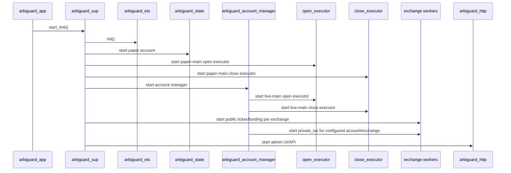
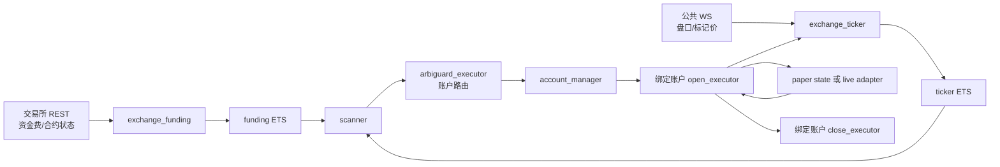
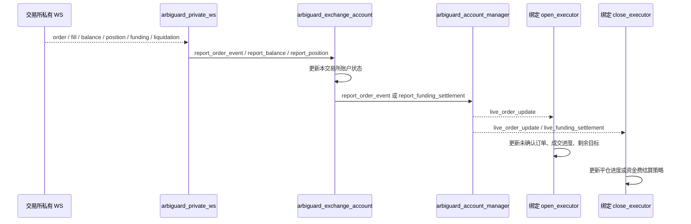
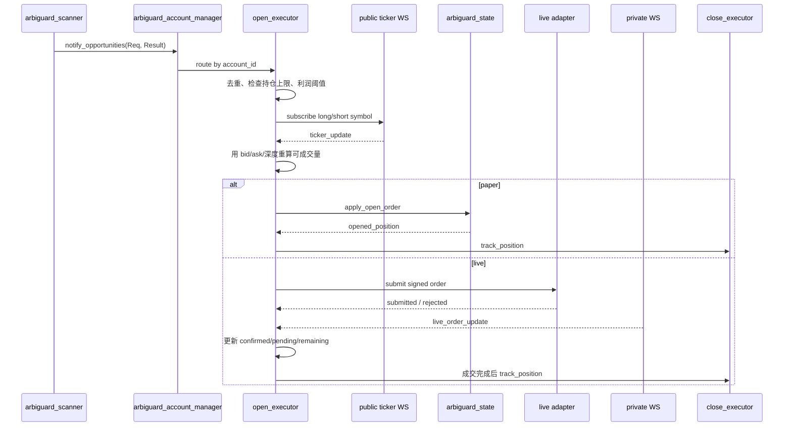
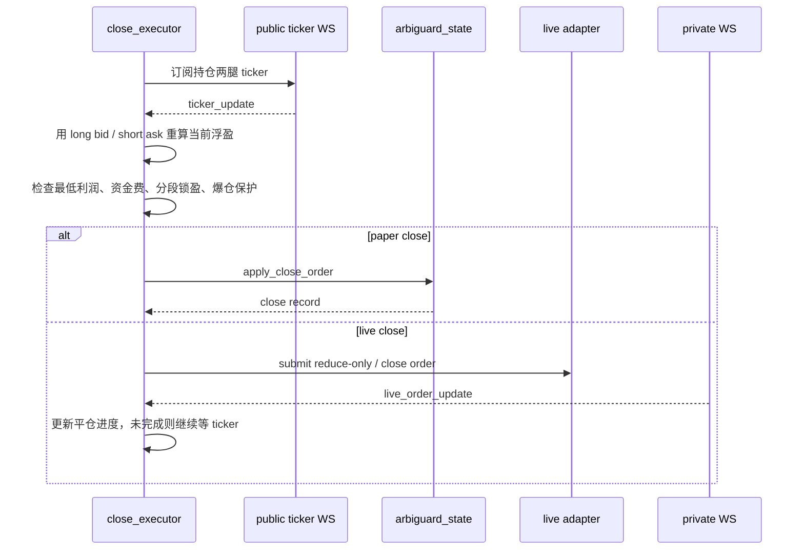

# ArbiGuard 架构与数据流

ArbiGuard 是一个 Erlang/rebar3 工程，只保留跨交易所永续合约套利业务，不包含 AI 训练代码。

当前核心目标是：

- 使用 REST 定时维护全市场资金费、合约状态和基础价格快照。
- 使用公共 WebSocket 维护进入执行阶段的币种盘口和标记价格。
- 使用私有 WebSocket 维护实盘交易所账户的订单、成交、余额、持仓、资金费和爆仓事件。
- 默认提供一个模拟总账户 `paper-main`。
- 新增实盘总账户时，自动附带该账户自己的开仓执行进程和平仓执行进程。
- 每个总账户下，每个配置了 API 权限的交易所有一个独立交易所账户进程。

## 目录结构

```text
src/
  account/
    arbiguard_account_manager.erl   总账户管理进程
    arbiguard_exchange_account.erl  单账户下的单交易所账户进程
    arbiguard_state.erl             默认模拟盘账户状态
  core/
    arbiguard_app.erl
    arbiguard_sup.erl
    arbiguard_config.erl
    arbiguard_ets.erl
    arbiguard_processes.erl
    arbiguard_runtime_config.erl
  exchange/
    arbiguard_exchange_ticker.erl   公共行情 WS
    arbiguard_exchange_funding.erl  资金费/合约信息 REST
    arbiguard_private_ws.erl        私有账户 WS
    arbiguard_live_adapter.erl      实盘下单适配器入口
    arbiguard_market.erl
  execution/
    arbiguard_executor.erl          执行入口路由
    arbiguard_open_executor.erl     开仓执行进程
    arbiguard_close_executor.erl    平仓执行进程
  http/
    arbiguard_http.erl              管理 UI/API
  strategy/
    arbiguard_calc.erl
    arbiguard_scanner.erl
  storage/
    arbiguard_trade_store.erl
  support/
    arbiguard_json.erl
    arbiguard_util.erl
  watch/
    arbiguard_symbol_watcher.erl
```

## 账户结构

### 总账户

总账户代表一套套利资金和执行逻辑。默认启动后有两个总账户概念：

```text
paper-main
  mode = paper
  open_executor  = arbiguard_open_executor
  close_executor = arbiguard_close_executor
  account_state  = arbiguard_state

live-main
  mode = live
  open_executor  = arbiguard_open_executor_live_main
  close_executor = arbiguard_close_executor_live_main
  exchange_accounts = 按配置/API 创建
```

新增总账户时：

1. `arbiguard_account_manager` 生成或接收 `account_id`。
2. 为该账户启动一个开仓执行进程。
3. 为该账户启动一个平仓执行进程。
4. 根据账户配置的交易所列表，为每个交易所启动交易所账户进程。
5. 如果交易所配置了私有 WS/API，则启动该账户下该交易所的私有 WS 监听。

如果启动时 `live-main` 没有配置交易所，它只会先创建自己的开仓/平仓执行进程；当后续通过 `/api/accounts` 创建账户，或通过 `/api/live/token` 给某个 `account_id + exchange` 写入 token 时，账户管理进程会补齐该交易所账户进程和私有 WS 进程。

### 交易所账户

交易所账户是 `总账户 + 交易所` 维度的进程。

它维护：

- API token 配置。
- 当前余额。
- 当前持仓。
- 订单事件。
- 资金费结算事件。
- 爆仓/强平/保证金风险事件。
- 私有 WS 回调日志。

交易所账户收到私有 WS 事件后，会把订单和资金费事件转发给绑定总账户的执行进程。

## 进程结构

```mermaid
graph TD
    SUP["arbiguard_sup"]
    ETS["named ETS tables<br/>ticker / funding / opportunity"]

    STATE["arbiguard_state<br/>默认模拟盘账户"]
    AM["arbiguard_account_manager<br/>总账户管理"]

    OPEN0["arbiguard_open_executor<br/>paper-main 开仓"]
    CLOSE0["arbiguard_close_executor<br/>paper-main 平仓"]
    OPENL["arbiguard_open_executor_live_main<br/>live-main 开仓"]
    CLOSEL["arbiguard_close_executor_live_main<br/>live-main 平仓"]

    EX_ACC["arbiguard_exchange_account<br/>account_id + exchange"]
    PRIVATE["arbiguard_private_ws<br/>account_id + exchange 私有 WS"]

    TICKER["arbiguard_exchange_ticker<br/>每交易所公共行情 WS"]
    FUNDING["arbiguard_exchange_funding<br/>每交易所资金费 REST"]
    WATCHER["arbiguard_symbol_watcher<br/>币种上下架/状态"]
    SCANNER["arbiguard_scanner<br/>套利机会扫描"]
    HTTP["arbiguard_http<br/>管理 UI/API"]

    SUP --> STATE
    SUP --> OPEN0
    SUP --> CLOSE0
    SUP --> AM
    SUP --> TICKER
    SUP --> FUNDING
    SUP --> WATCHER
    SUP --> SCANNER
    SUP --> HTTP
    SUP -. "init/0 创建" .-> ETS

    AM --> OPENL
    AM --> CLOSEL
    AM --> EX_ACC
    AM --> PRIVATE

    TICKER --> ETS
    FUNDING --> ETS
    SCANNER --> ETS
```



`arbiguard_ets` 不是进程，它只是 ETS helper module。ETS 表由 `arbiguard_sup:init/1` 直接创建。

## ETS 表

```text
arbiguard_ticker_ets       公共行情/盘口/标记价
arbiguard_funding_ets      资金费、结算周期、合约状态
arbiguard_opportunity_ets  最近扫描出的机会
```

行情和资金费的 key：

```erlang
{Exchange, Symbol}
```

机会 key：

```erlang
{Symbol, LongExchange, ShortExchange}
```

注意：资金费数据不应该写入 ticker ETS。ticker ETS 只放盘口、成交参考价、标记价、更新时间等行情数据。

## 启动流程



启动后默认可以直接使用模拟盘。实盘需要：

1. 创建或使用 `live-main` 总账户。
2. 给对应交易所写入 API token。
3. 账户管理进程为该 `account_id + exchange` 创建交易所账户进程和私有 WS 进程。
4. 等待私有 WS 登录成功并订阅账户频道。
5. 实盘开关启用后才允许真实下单。

## 扫描到开仓数据流



开仓执行逻辑：

1. `arbiguard_scanner` 从 ETS 读取资金费和价格，生成机会。
2. `arbiguard_executor` 根据 `account_id/account_mode` 把机会交给账户管理层。
3. `arbiguard_account_manager` 找到绑定的开仓执行进程。
4. 开仓执行进程检查：
   - 最低预期利润。
   - 最大持仓笔数。
   - 持仓唯一键。
   - 当前账户模式。
5. 进入执行阶段后，执行进程通知公共 WS 进程订阅指定币种。
6. 任意一侧 ticker 更新时，执行进程读取两侧最新 bid/ask。
7. 使用实时 bid/ask 和可成交数量重新计算是否满足执行条件。
8. 模拟盘直接按盘口计算模拟成交。
9. 实盘通过交易所下单适配器提交订单，随后等待私有 WS 成交回报。

## 实盘私有 WS 数据流



私有 WS 的职责不是做交易决策，而是提供交易所真实回调：

- 订单已提交。
- 部分成交。
- 全部成交。
- 撤单。
- 余额变化。
- 持仓变化。
- 资金费结算。
- 爆仓、强平、保证金风险。

执行进程收到回调后再决定是否继续提交下一批订单。

## 开仓时序



## 平仓时序



## 公共 WS 与本地订阅

公共行情进程维护两种订阅概念：

1. 交易所 WS 订阅：真正向交易所订阅某个 symbol。
2. 本地订阅：执行进程告诉行情进程，“如果收到这个 symbol 的 ticker，也给我发一份”。

本地订阅必须带订阅方 PID，否则行情进程不知道要把消息转发给谁。

执行进程只要还在开仓或平仓执行阶段，就必须保持：

- 交易所 WS 订阅存在。
- 本地订阅存在。

当开仓任务完成、平仓任务完成、订单被移除或过期时，执行进程需要取消本地订阅；如果该 symbol 没有其他执行任务需要，行情进程再取消交易所 WS 订阅。

## API

默认地址：

```text
http://127.0.0.1:8771
```

常用接口：

```text
GET  /
GET  /api/health
GET  /api/config
GET  /api/processes
GET  /api/accounts
POST /api/accounts
GET  /api/executor/state
GET  /api/funding/state
GET  /api/live/state
POST /api/live/token
POST /api/live/enabled
POST /api/live/test-order
POST /api/funding/scan
POST /api/funding/apply-settings
POST /api/funding/paper/reset
GET  /api/trades/history
POST /api/trades/history
GET  /api/trades/stats
POST /api/trades/stats
```

`POST /api/accounts` 示例：

```json
{
  "id": "live-main",
  "mode": "live",
  "name": "主实盘账户",
  "exchanges": ["binance", "okx", "gate", "htx"]
}
```

`POST /api/live/token` 示例：

```json
{
  "account_id": "live-main",
  "exchange": "okx",
  "api_key": "...",
  "api_secret": "...",
  "passphrase": "..."
}
```

`/api/live/token` 现在直接写入 `account_id + exchange` 维度的交易所账户进程。

## 当前实现边界

已经落地：

- 默认模拟总账户。
- 默认实盘总账户。
- 新增总账户时创建独立开仓/平仓执行进程。
- 新增总账户时创建交易所账户进程。
- 私有 WS 支持 `account_id + exchange` 维度。
- 私有 WS 事件优先写入交易所账户进程，再转发给绑定执行进程。
- HTTP 提供账户查看和创建接口。

仍需要继续补全的交易所适配：

- 各交易所真实签名下单。
- 各交易所私有 WS 登录和订阅的完整实现。
- 各交易所订单/成交/余额/持仓字段的精确映射。
- 实盘下单前的交易所精度、最小下单量、最大委托量、reduce-only、FOK/IOC 支持校验。

也就是说，账户和进程结构已经按目标拆开，实盘状态不再走全局账户进程；真实实盘可用性取决于各交易所 adapter 的签名下单和私有 WS 字段适配是否补齐。
