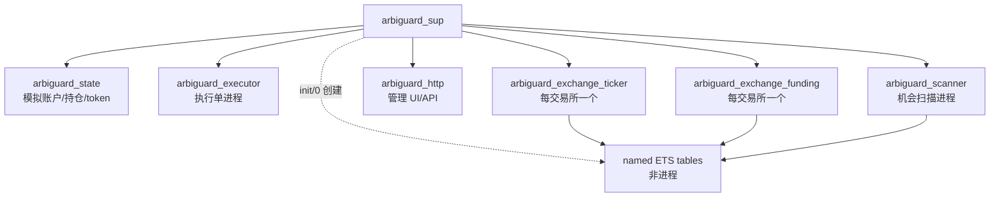
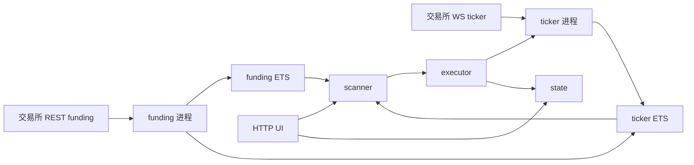
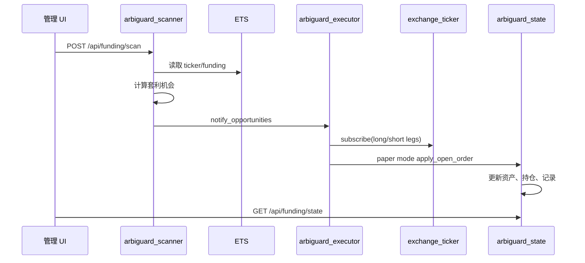

# ArbiGuard 架构与接口说明

ArbiGuard 是一个跨交易所永续合约套利工程。当前工程只保留套利业务，不包含 AI 训练或模型逻辑。

## 目标

- 每个交易所独立维护 ticker 监听进程。
- 每个交易所独立维护 funding 拉取进程。
- ticker 和 funding 数据写入 named ETS 表。
- 扫描进程从 ETS 读取数据，计算资金费、价差、资金费+价差机会。
- 执行单进程接收机会，制定目标仓位和订阅需求。
- 模拟账户进程维护资产、持仓、交易记录和实盘 token 配置。
- HTTP 服务提供管理 UI 和 JSON API。

## 目录结构

```text
src/
  account/
    arbiguard_state.erl
  core/
    arbiguard_app.erl
    arbiguard_sup.erl
    arbiguard_config.erl
    arbiguard_ets.erl
    arbiguard_processes.erl
  exchange/
    arbiguard_market.erl
    arbiguard_exchange_ticker.erl
    arbiguard_exchange_funding.erl
  execution/
    arbiguard_executor.erl
  http/
    arbiguard_http.erl
  strategy/
    arbiguard_calc.erl
    arbiguard_scanner.erl
  support/
    arbiguard_json.erl
    arbiguard_util.erl
```

## OTP 进程结构



`arbiguard_ets` 不是 supervisor child，也不是业务进程。它只是 ETS helper module。
`arbiguard_sup:init/1` 会直接调用 `arbiguard_ets:init/0` 创建 named ETS 表。

## ETS 表

```text
arbiguard_ticker_ets
arbiguard_funding_ets
arbiguard_opportunity_ets
```

Key 统一使用：

```erlang
{Exchange, Symbol}
```

机会表使用：

```erlang
{Symbol, LongExchange, ShortExchange}
```

## 数据流程



## 扫描到执行时序



## HTTP 接口

默认地址：

```text
http://127.0.0.1:8771
```

接口：

```text
GET  /
GET  /api/health
GET  /api/config
GET  /api/processes
GET  /api/executor/state
GET  /api/funding/state
POST /api/funding/scan
POST /api/funding/paper/reset
```

首页 `/` 是管理 UI，可以刷新状态、手动扫描、重置模拟盘，并展示：

- 账户概览
- ETS 行数
- 每个交易所 ticker/funding 进程状态
- 扫描机会
- 模拟持仓
- 成交/未执行记录

## 主要模块接口

### arbiguard_exchange_ticker

```erlang
start_ws(ExchangeID).
subscribe(ExchangeID, Symbol, Reason).
unsubscribe(ExchangeID, Symbol, Reason).
upsert_ticker(ExchangeID, Row).
snapshot(ExchangeID).
```

### arbiguard_exchange_funding

```erlang
refresh(ExchangeID).
snapshot(ExchangeID).
```

### arbiguard_scanner

```erlang
scan_once(Req).
snapshot().
```

### arbiguard_executor

```erlang
notify_opportunities(Req, Result).
submit_order(Req, Opportunity).
snapshot().
```

### arbiguard_state

```erlang
snapshot().
reset_paper(Payload).
apply_open_order(Req, Order, Opportunity).
set_exchange_token(ExchangeID, TokenConfig).
get_exchange_token(ExchangeID).
```

## 配置

配置文件：

```text
config/sys.config
config/vm.args
```

常用配置：

```erlang
{http_port, 8771}.
{paper_capital_usdt, 10000.0}.
{scanner_interval_ms, 1000}.
{funding_refresh_ms, 60000}.
{ticker_ws_enabled, true}.
```

日志：

```text
log/arbiguard.log
log/error.log
```
