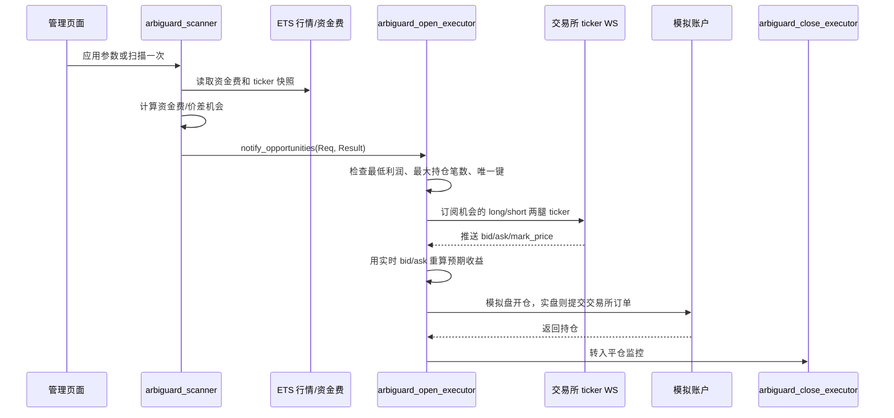

# ArbiGuard 套利执行规则

本文档说明当前 Erlang 版资金费/价差套利的参数生效时机、开仓规则、平仓规则、资金费结算规则和单边爆仓保护。

## 参数什么时候生效

管理页面输入框只是本地页面值，修改后不会自动进入后台。

生效方式有两种：

1. 点击 `应用参数`
   - 调用 `POST /api/funding/apply-settings`。
   - 参数写入 `arbiguard_scanner` 的 `active_request`。
   - 后续后台定时扫描会使用这份参数。
   - 不会立刻做一次扫描，但下一个扫描周期会生效。

2. 点击 `扫描一次`
   - 调用 `POST /api/funding/scan`。
   - 立即用当前页面参数扫描一次。
   - 同时把参数写入 `arbiguard_scanner`，后续定时扫描继续使用。

`刷新` 只读取状态，不会应用输入框参数。

## 主要参数

| 页面字段 | 后端字段 | 作用 |
| --- | --- | --- |
| 本金 USDT | `capital_usdt` | 模拟盘总本金，重置模拟盘时重新分配到交易所。 |
| 单币保证金上限 USDT | `execution_notional_usdt` | 单个套利组合每条腿使用的保证金上限。 |
| 杠杆 | `paper_leverage` | 用于计算名义仓位和预估爆仓价。 |
| 最大持仓笔数 | `max_open_positions` | 当前持仓 + 待执行开仓单不能超过该数量。 |
| 单币最大仓位比例 | `max_position_pct` | 单币保证金不能超过本金的该比例。 |
| 最低资金费差 | `min_funding_rate` | 资金费机会筛选阈值。 |
| 最低价格差 | `min_price_gap_rate` | 跨交易所价格差机会筛选阈值。 |
| 最大基差 | `max_basis_rate` | 过滤价格偏离过大的机会，避免异常/停牌/错误行情。 |
| 最低预期利润 USDT | `min_execution_profit_usdt` | 开仓最低预期利润，也是持仓达到该实际浮盈后立即启动平仓的阈值。 |
| 展示数量 | `limit` | 页面展示和提交给执行进程的机会数量上限。 |

## 开仓流程



开仓执行使用实时 bid/ask：

- 做多腿按 `ask` 成交。
- 做空腿按 `bid` 成交。
- 标记价 `mark_price` 只用于爆仓风险判断，不用于模拟成交价。
- 如果实时重算后的预期利润低于 `min_execution_profit_usdt`，执行单继续等待，不开仓。

持仓唯一键：

```text
账户ID + 账户模式 + 币种 + 做多交易所 + 做空交易所
```

同一个键不会重复开仓。

## 仓位计算

单个机会的目标名义仓位：

```text
min(单币保证金上限, 本金 * 单币最大仓位比例) * 杠杆
```

如果交易所配置了单次委托上限，则取两腿交易所上限的最小值。

开仓时两边都要有足够余额：

```text
每腿需要余额 = 保证金 + 开仓手续费
保证金 = 名义仓位 / 杠杆
```

## 平仓规则

平仓执行进程 `arbiguard_close_executor` 独立负责平仓，不需要外部主动调用。

每次收到持仓两腿的 ticker 后：

1. 用做多腿 `bid` 作为多头平仓价。
2. 用做空腿 `ask` 作为空头平仓价。
3. 用当前平仓价、资金费、预估平仓手续费重算实际浮盈。
4. 判断是否启动平仓。

平仓优先级：

1. 单边爆仓保护触发。
2. 下架/停牌风险，且当前有盈利。
3. 当前实际浮盈达到 `min_execution_profit_usdt`，立即平仓。
4. 已经收到资金费结算，且下一轮资金费会变成亏损时，按分段锁盈平仓。
5. 资金费结算后，实际浮盈达到最低利润，平仓。
6. 常规分段锁盈。

常规分段锁盈沿用之前 Go 版的规则：

```text
当前周期 0% ~ 20%: 实际浮盈 >= 预期利润 * 95%
当前周期 20% ~ 40%: 实际浮盈 >= 预期利润 * 90%
当前周期 40% ~ 60%: 实际浮盈 >= 预期利润 * 85%
当前周期 60% ~ 80%: 实际浮盈 >= 预期利润 * 80%
当前周期 80% 以后: 实际浮盈 >= 预期利润 * 50%，或只要有盈利就平
```

如果资金费结算周期不同：

- 最近一次结算必须是正收益才保留机会。
- 最近一次正收益结算后，如果下一次结算会产生亏损，则执行锁盈平仓计划。
- 这样避免“刚吃到一次资金费，但下一轮把利润吐回去”。

## 单边爆仓保护

开仓时会保存预估爆仓价：

```text
多头预估爆仓价 = 多头开仓价 * (1 - 1 / 杠杆)
空头预估爆仓价 = 空头开仓价 * (1 + 1 / 杠杆)
```

实际交易所会使用自己的维持保证金率和标记价格计算爆仓价，当前模拟盘用上面的近似公式做风险预警。后续接实盘账户时，应优先使用交易所返回的真实 liquidation price。

平仓监控使用标记价触发爆仓保护：

```text
多头风险: long_mark_price <= long_liquidation_price * (1 + buffer)
空头风险: short_mark_price >= short_liquidation_price * (1 - buffer)
```

`buffer` 默认是 `1%`，配置项：

```erlang
{liquidation_guard_buffer_rate, 0.01}.
```

触发后：

1. 前 0.5 秒：如果按标记价计算仍有盈利，立即平仓。
2. 超过 0.5 秒：不再等盈利，进入快速平仓，目标是消除单边爆仓风险。

规则标记：

```text
liquidation_hedge_profit_0_5s
liquidation_hedge_market_1s
```

## 资金表字段

管理页面交易所资金表拆分为：

| 字段 | 含义 |
| --- | --- |
| 可用余额 | 交易所模拟账户当前可用余额。 |
| 余额+持仓权益 | 可用余额 + 持仓保证金 + 该交易所腿的浮盈。 |
| 持仓占用 | 该交易所当前持仓占用的保证金。 |
| 浮盈 | 该交易所当前腿的浮动盈亏。 |

注意：`持仓占用` 不是盈利，它只是锁在仓位里的保证金。

## 当前浮盈计算方式

模拟盘持仓里的 `当前浮盈` 来自 `unrealized_pnl`，由平仓执行进程在收到两边 WS ticker 后重算，并回写到模拟账户状态。

平仓价格来源：

```text
多头平仓价 = 做多交易所当前 bid
空头平仓价 = 做空交易所当前 ask
```

计算公式：

```text
多头价差盈亏 = (多头平仓价 - 多头开仓价) * 多头数量
空头价差盈亏 = (空头开仓价 - 空头平仓价) * 空头数量
价差盈亏 = 多头价差盈亏 + 空头价差盈亏

预估平仓手续费 = 名义仓位 * (多头 taker 费率 + 空头 taker 费率)

当前浮盈 = 价差盈亏 + 已结算资金费盈亏 - 预估平仓手续费
```

注意：

- 开仓手续费已经在开仓时从可用余额扣除，不再重复计入 `当前浮盈`。
- 未结算资金费不会计入当前浮盈，只会放在预期盈利和下一周期判断里。
- 如果某条持仓缺少任意一边 ticker，平仓执行进程无法重算，该持仓会保持上一次浮盈。
- 爆仓风险判断使用 `mark_price`，但当前浮盈使用真实可成交方向的 `bid/ask`。

## 代码位置

| 功能 | 文件 |
| --- | --- |
| 参数标准化和机会计算 | `src/strategy/arbiguard_calc.erl` |
| 定时扫描和参数应用 | `src/strategy/arbiguard_scanner.erl` |
| 开仓执行单 | `src/execution/arbiguard_open_executor.erl` |
| 平仓执行单 | `src/execution/arbiguard_close_executor.erl` |
| 模拟账户、持仓、资金统计 | `src/account/arbiguard_state.erl` |
| HTTP API 和 UI 服务 | `src/http/arbiguard_http.erl` |
| 前端页面 | `priv/www/index.html` |
